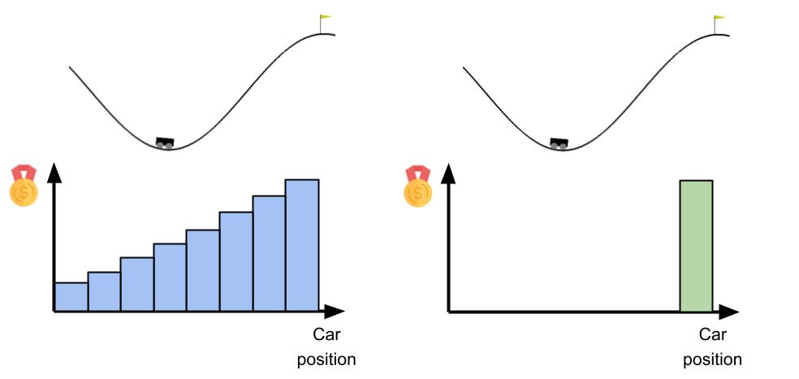
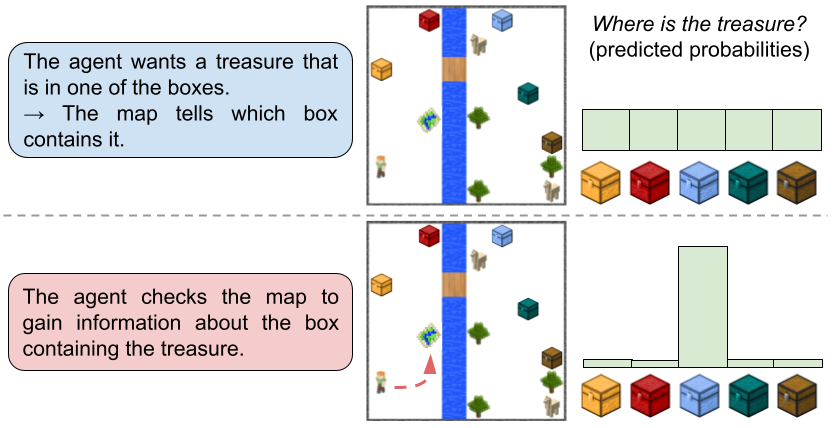
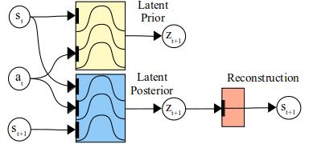
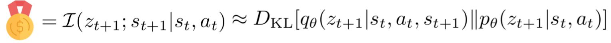
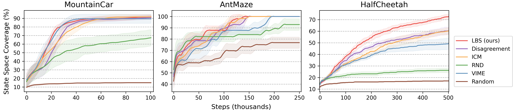
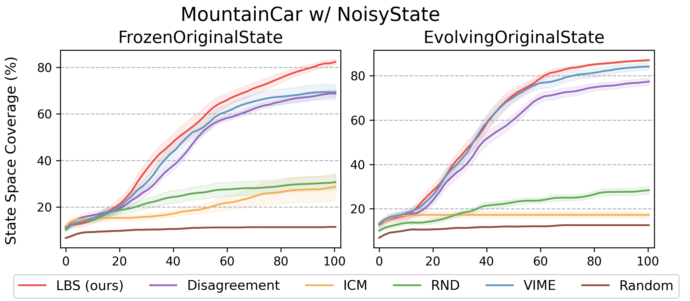

Among the human traits that correlate with intelligence, _curiosity_, as the desire of gaining greater knowledge about the world or ourselves, is one of the most fascinating. With the aid of artificial curiosity, current techniques for control could be equipped with more natural skills, such as self-motivated exploration.

In this post, we introduce **Latent Bayesian Surprise**, an objective that drives artificial agents to be curious and explore interactions with the environment that reduce their uncertainty. Our approach works well across a wide set of tasks and shows to be resilient to the issue of stochasticity. For more details, please check out [the full paper](https://arxiv.org/abs/2104.07495), published at the AAAI 22 conference.

## Why Exploration?

In control techniques, such as reinforcement learning, the utility value that the agent should maximize to perform a task is distributed across the environment. In some cases, this signal is densely provided for all states and actions encountered. However, in other cases, the signal may be very sparse, only providing the agent with a feedback signal when it is relatively close to accomplishing the task. An example is shown below with respect to the Mountain Car environment.

  

The agent can receive a signal that progressively drives it towards the goal at top of the right hill, as show on the left, or being rewarded only when reaching the top, as on the right. The problem in the second scenario is that, if the agent doesn't know where to go, it may easily get stuck at the bottom of the valley and fail the task.

 > How should agents find information that allows them to accomplish their tasks?

The solution is _exploration_! Agents should try out different actions and reach unknown states of the environment, to increase awareness about their surroundings. There are several ways to perform exploration. An agent could for instance just act randomly every and now and then, and eventually explore all possible actions and states. However, this process may take an infinite amount of time and recent research has focused on establishing more informed ways to perform exploration.

## Bayesian Surprise

Bayesian surprise is an information measure to quantify how some data affects the agent's knowledge, by measuring differences between posterior and prior beliefs of the agent, i.e. the difference in the agent's knowledge after versus before observing the data. Another way to talk about Bayesian surprise is in terms of [information gain](https://en.wikipedia.org/wiki/Mutual_information). Bayesian surprise assesses how much information is gained by the agent by observing the data. An example in a simplified 2D Minecraft world is provided below.

  

Initially, the agent knows there is a treasure in one of the boxes but it does not know in which one. If the agent gets only one chance to open a box, randomly picking is not the optimal way to act. Luckily there is a map that tells exactly which box contains the treasure. The agent may want to first go there, gaining information that reduces the uncertainty of its beliefs about the boxes, and then directly go for the right box. 

As can be seen on this figure, one may think of information gain or Bayesian surprise as the extent to which the agent's beliefs distribution (e.g. about which box contains the treasure) becomes narrower with new data (e.g. the information from the map). A more in-depth analysis of Bayesian surprise can be found [here](https://papers.nips.cc/paper/2005/hash/0172d289da48c48de8c5ebf3de9f7ee1-Abstract.html).

## Latent Bayesian Surprise

In our work, we propose an exploration strategy based on Bayesian surprise. In order to compute the information gained by observing new data, the agent needs a model that provides beliefs about the environment. For this reason, we let the agent learn a *latent* (hidden/intermediate) probabilistic representation of the environment, which constitutes the agent's beliefs. 

The agent's model is made of three main components (the subscripts $t$ and $t+1$ indicate time steps): 
* a _reconstruction model_ $p(z_t|s_t)$, which maps latent beliefs $z_t$ to environment states $s_t$; 
* a _latent prior_ $p(z_{t+1}|s_t, a_t)$, which predicts the next latent beliefs $z_{t+1}$ given the current information (state $s_t$ and the action taken $a_t$);
* a _latent posterior_ $q(z_{t+1}|s_t, a_t, s_{t+1})$, which recognizes the true beliefs for the state $s_{t+1}$, given the additional information.

An illustration of the model is presented below:

  

Thanks to defining this model, and, crucially, the latent variable $z$, it is now possible to compute the information gained about the latent variable, when collecting new information about the environment state. We define the Latent Bayesian Surprise (LBS) signal as:

  

that translates the information gain term into the [KL divergence](https://en.wikipedia.org/wiki/Kullback%E2%80%93Leibler_divergence) between the distribution of the latent posterior, which has access to the information in $s_{t+1}$, compared to the latent prior distribution. By maximizing Latent Bayesian Surprise, the agent looks for states of the environment that will inform better the latent model it has learned. Our method is based on curiosity in that the agent will search for interesting interactions that should increase its knowledge and reduce uncertainty about the environment. 

Note that reducing uncertainty is also a key aspect in active inference, which we introduced in [a previous post](https://thesmartrobot.github.io/2020/05/27/active-inference.html).

## Exploiting Curiosity

We tested our method for exploration and curiosity in a wide variety of tasks. 

In a set of continuous control tasks, we find that our agent consistently explores more states of the environment than other exploration approaches:

  

We obtained outstanding results in some arcade games, where our agent is able to play by just using its curiosity signal (i.e. curious behaviour encourages playing). Some examples videos are shown below:

  <video width="45%" controls>
    <source src="/video/09_breakout.mp4" type="video/mp4">
  Your browser does not support the video tag.
  </video> 

  <video width="45%" controls>
    <source src="/video/09_mario.mp4" type="video/mp4">
  Your browser does not support the video tag.
  </video> 

Finally, we experimented with the DM Control Suite, where we first collect data using our LBS exploring agent, and then train an offline RL agent using only the exploration data. In this experiment, we show that the data collected with our method allows for faster training of the RL agent. Some examples are shown below:

  

    <b>Exploration</b>
  

  

    <b>Task</b>
  

 

    

    

        

            
Hopper Hop

            
Walker Walk

        

    

  

    

        

            
        

        

            
        

    

  

  

    

        

            
        

        

            
        

    

  

For more visual results, check out the [project page](https://lbsexploration.github.io/).

  
## Stochasticity

Stochasticity, i.e. uncontrollable randomness in the environment, is an important issue to address when the agent is driven by curiosity. If the agent simply looks for areas of the environment that it can't accurately predict, it can get stuck in a stochastic noisy state, which constantly changes without bringing any important information for the task. This problem is known in literature as the ["Noisy TV" problem](https://arxiv.org/abs/0812.4360).

Our method, being driven by the principle of looking for interactions that bring significant information to the agent's model, allows to overcome stochasticity, assuming that the latent variable $z$ (and so the model) ignores the meaningless noise. We also empirically show this in two variations of the Mountain Car problem, where the agent possesses a remote that triggers a "Noisy TV":

  

Our method achieves the best performance in both variants of the environment. The other two approaches that are also resilient to stochasticity, [VIME](https://arxiv.org/abs/1605.09674) and [Disagreement](https://arxiv.org/abs/1906.04161), are also based upon information gain but over parameters, rather than in latent space. The other exploration strategies failed to explore consistently, as they got stuck in front of the "Noisy TV".

## Future Perspectives

The ability to resolve uncertainty in the environment is a fundamental ability of humans. Every time we need to do something, we tend to first secure that our actions will succeed, e.g. if you need to buy a product, you would likely first search online or ask around to find the best store to buy it, rather than just wandering around until finding what you need.

In a similar way, artificial agents should be curious and find relevant information in the environment by themselves. Exploration approaches such as Latent Bayesian Surprise, which shows outstanding performance across several tasks, are very important in this. At the same time, research should be careful about the Noisy TV problem. Although we found our method to be resilient to simple artificial noise patterns, future studies should focus on studying how more complex stochasticity can affect exploration and to what extent current methods are robust. In addition, we also aim to investigate on how to further structure the latent representation of the model, e.g. using [contrastive learning approaches](https://thesmartrobot.github.io/2021/11/18/contrastive-actinf.html), in order to lead to more efficent and well-directed exploration. 
